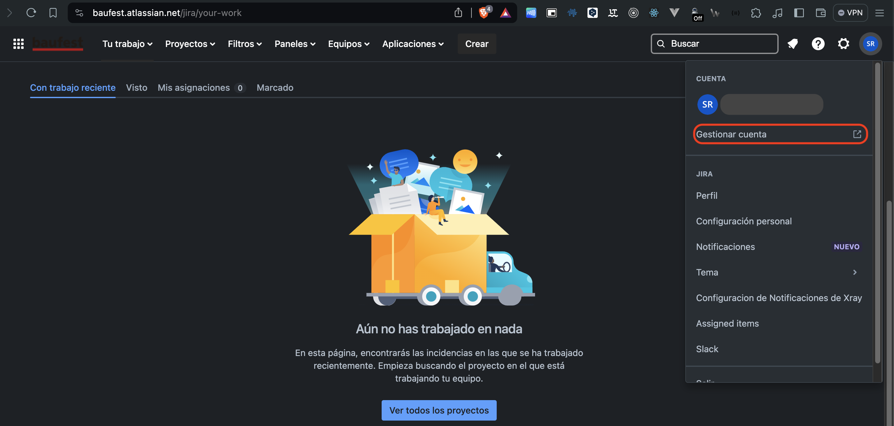
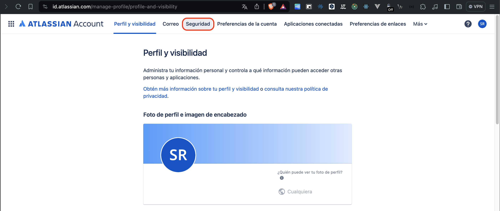
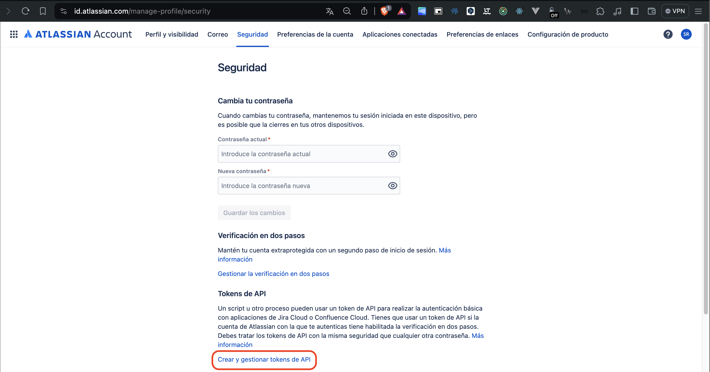
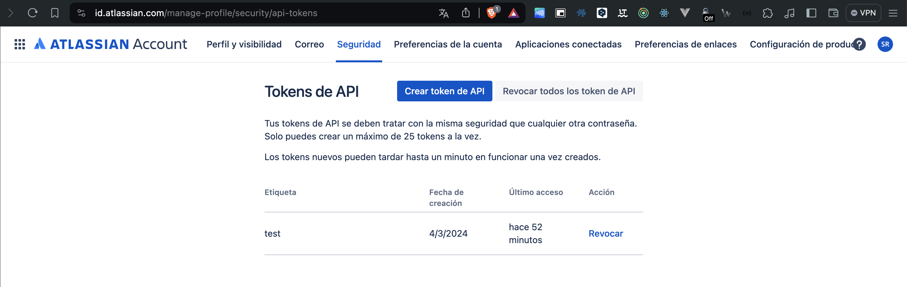
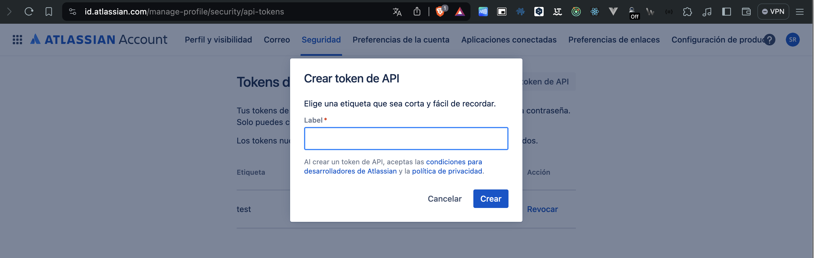
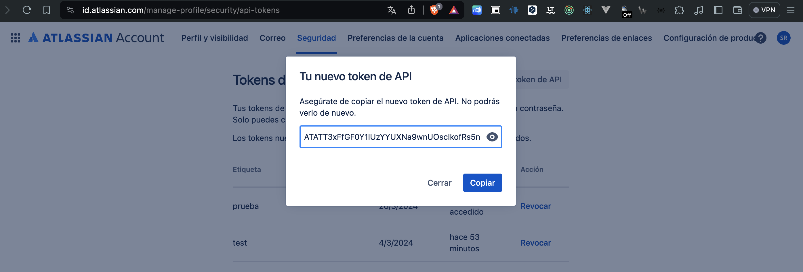
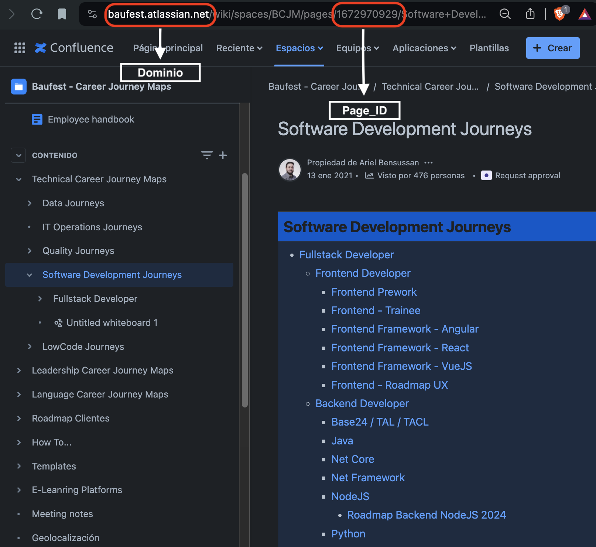
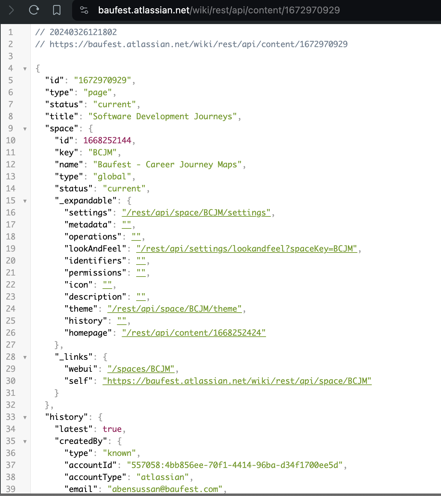

# Uso de la API de Confluence

Lista de paso para el uso de la API de Confluence

## Creación del Token para utilizar la API de Confluence

1. Acceder a Confluence o a la siguiente liga https://baufest.atlassian.net/jira/your-work

2. Dar clic sobre el icono del perfil y seleccionar la opción gestionar la cuenta



3. Se abrirá una nueva ventana con la siguiente liga https://id.atlassian.com/manage-profile/profile-and-visibility

4. Dar clic sobre seguridad o ir a la siguiente liga https://id.atlassian.com/manage-profile/security



5. Ir a la sección de 'Tokens de API' y dar clic sobre Crear y gestionar tokens https://id.atlassian.com/manage-profile/security/api-tokens



6. Dar clic sobre crear token de API



7. Nombrar el Token



8. Guardar el token en una nota o donde se crea más conveniente ya que no se podrá volver a ver



## Obtener información de la API de Confluence

Para este ejemplo se utilizó el lenguaje de programación Python

Para poder obtener la información de Confluence desde la API es necesario lo siguiente

1. Crear un entorno virtual e Instalar los requirements.txt

```
python -m virtualenv venv
.\venv\Scripts\activate

pip install -r "requirements.txt"
```

2. Es necesario tener los siguientes datos, el usuario tiene que ser el mismo que creo el token, la page_id es de la pagina de la cual queremos obtener la informacion

- dominio_confluence = 'baufest.atlassian.net'
- page_id = '903413870' 
- usuario = 'admin@baufest.com'
- token = '**********'

Ejemplo para obtener page_id 



3. Los datos anteriores son necesarios para poder realizar la petición HTTP para ello se realizó el siguiente código

- El valor url es la combinacion de dominio_confluence y page_id

- Ejemplo: https://baufest.atlassian.net/wiki/rest/api/content/1672970929


```
def solicitud_get(url, usuario, token):
    try:
        response = requests.get(url, auth=HTTPBasicAuth(usuario, token))
        response.raise_for_status()
        return response.json()
    except requests.exceptions.HTTPError as err:
        print(f'Error HTTP: {err} en {url}')
    except requests.exceptions.RequestException as e:
        print(f'Error de red: {e} en {url}')
    return None
```

4. La petición regresará la información en formato JSON como la siguiente imagen



5. Existen diferentes URL para obtener información, en este proyecto se utilizaron las siguientes

- https://baufest.atlassian.net/wiki/rest/api/content/1672970929'
- https://baufest.atlassian.net/wiki/rest/api/content/1672970929?expand=body.view'
- https://baufest.atlassian.net/wiki/rest/api/content/1672970929/child/page'

La información que trae la siguiente URL es autor, fecha de creación, versión, quien fue el último que edito la página, el nombre de la página.

https://baufest.atlassian.net/wiki/rest/api/content/1672970929'

La información que trae la siguiente URL es todo el texto que tiene la página.

https://baufest.atlassian.net/wiki/rest/api/content/1672970929?expand=body.view'

La información que trae la siguiente URL es todas las paginas hijas que tiene.

https://baufest.atlassian.net/wiki/rest/api/content/1672970929/child/page'

Dependiendo de la información necesaria se utilizará una URL en especial en el siguiente ejemplo se pondrá el código y lo que se obtendrá 

```
def extraer_contenido(contenido, objeto):

    contenido_general = contenido['body']['view']['value']
    soup = BeautifulSoup(contenido_general, 'html.parser')
    texto = soup.get_text()
    
    objeto["contenido"] = texto
    
    return objeto
```

De la petición antes realizada se manda el JSON y un objeto en donde se guardara el resultado para solamente obtener el texto que tiene la página se tiene que poner lo siguiente, ya que el  JSON es un diccionario y el texto esta en la siguinte ruta ['body']['view']['value'], después se utiliza BeautifulSoup para quitar los tags de HTML que regresa la página y solo obtener el texto 

Para saber mas sobre las diferentes rutas revisar la documentacion del API de confluence 
https://developer.atlassian.com/server/confluence/confluence-rest-api-examples/
